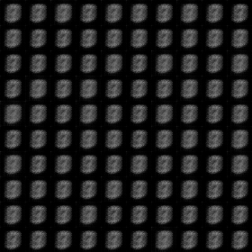
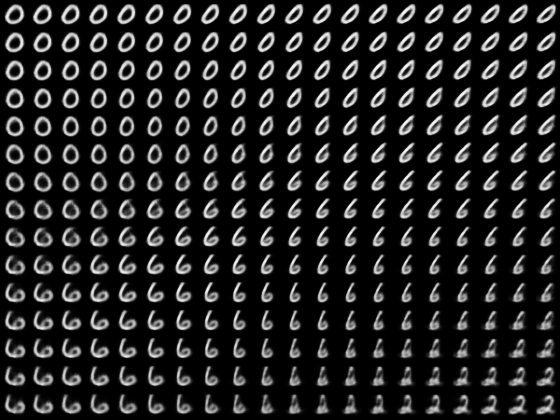

# MnistRecognition
MNIST handwritten digit recognition system (Artificial Intelligence final project)

## Supervised Learning

|model|Accuracy|
|:---:|:---:|
|two layer full connected network|97.546|
|two layer cnn and a full connected layer|99.219|

Use two layer full connected network to study accuracy in different training samples

You can see that 81% is achieved with only 250 samples and 90% with 2000. You need 27x the data to go from 90% to 97.5% with the simple network.

## Semi-Supervised Learning

What about a world where you only have **2000 labeled samples** but **have another 53000 unlabeled samples**?
Can we somehow learn something in an unsupervised way from all 55000 digits that might help us to better than our 90% baseline?
This is the goal of semi-supervised learning.

### AutoEncoder
First we learn an AutoEncoder,that encoder the input image to a embedding and then
decode the embedding to reconstruct the image.

The following gif is the AutoEncoder learning process,reconstruct image at different stages of learning:

we can also directly randomly generate embedding vector and  construct image

Below is a scatter plot of the 10,000 training samples from MNIST embedded in a 2-D space.

### Help Supervised Learning

We send the embedding(learned from autoencoder) of the image into a fully connected neural network.

|model|Accuracy|
|:---:|:---:|
|2000 labeled samples,supervised|88.030|
|2000 labeled samples,53000 unlabeled samples,semi-supervised|92.176|

Reference:
- [Auto-Encoding Variational Bayes](https://arxiv.org/pdf/1312.6114.pdf)

## Reinforcement Learning
Neural Architecture Search (NAS) with Reinforcement Learning is a method for finding good neural networks architecture.
For this part, we will try to find optimal architecture for Convolutional Neural Network (CNN) which recognizes handwritten digits.

Reference:
- [Neural Architecture Search with Reinforcement Learning](https://arxiv.org/pdf/1611.01578.pdf)
- [The First Step-by-Step Guide for Implementing Neural Architecture Search with Reinforcement Learning Using TensorFlow](https://lab.wallarm.com/the-first-step-by-step-guide-for-implementing-neural-architecture-search-with-reinforcement-99ade71b3d28)

## Evolutionary Computation

Reference:
- [EDEN: Evolutionary Deep Networks for Efficient
Machine Learning](https://arxiv.org/pdf/1709.09161.pdf)
- [MNIST_Evolutionary_Algorithm](https://github.com/asbran/MNIST_Evolutionary_Algorithm)
- [Picture_Evolution](https://github.com/ncblair/Picture_Evolution)